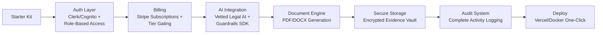

# 🛠️ Justice Tech Dev Starter Kit — Everything a Builder Needs to Launch Fast


## The Problem

Every justice tech project starts from scratch — setting up auth, billing, AI integration, document generation, secure storage, and audit logging. Months of boilerplate before building anything useful. The access-to-justice gap widens while developers reinvent the same infrastructure.

## The Solution

The ultimate boilerplate for justice tech applications. Pre-configured with auth (Clerk/Cognito), Stripe billing, AI integration, document generation, encrypted storage, audit logs, and role-based access. Clone, configure, build. Ship a production-ready justice app in days, not months.



## Who This Helps

- **Justice tech startups** — skip months of infrastructure setup
- **Hackathon teams** — build a complete justice app in a weekend
- **Legal aid developers** — focus on the mission, not the plumbing
- **Court IT modernization projects** — production-ready patterns from day one
- **JTA members building tools** — battle-tested architecture out of the box

## Features

- **Pre-configured authentication** — Clerk + Cognito support with role-based access
- **Stripe subscription billing** — tier gating, checkout, and webhook handling
- **AI integration with guardrails** — vetted legal AI with safety checks built in
- **Document generation** — PDF + DOCX templates for court filings
- **Encrypted evidence storage** — AES-256 encrypted file storage
- **Complete audit logging** — every action tracked for compliance
- **Role-based access control** — admin, attorney, litigant, public roles
- **One-click deploy** — Vercel or Docker with environment auto-detection
- **TypeScript + Next.js 15 + Tailwind** — modern stack, zero config
- **90%+ test coverage** — comprehensive test suite out of the box

## Quick Start

```bash
# Clone the starter kit
npx create-next-app@latest my-justice-app --example https://github.com/dougdevitre/justice-dev-starter-kit

# Or clone directly
git clone https://github.com/dougdevitre/justice-dev-starter-kit.git my-justice-app
cd my-justice-app

# Install dependencies
npm install

# Configure environment
cp .env.example .env.local
# Edit .env.local with your API keys

# Start development
npm run dev
```

```typescript
// src/app/api/ai/route.ts — AI query endpoint with guardrails
import { requireAuth, checkRole } from '@/lib/auth';
import { queryAI } from '@/lib/ai';
import { logAudit } from '@/lib/audit';

export async function POST(request: Request) {
  const user = await requireAuth(request);
  checkRole(user, ['attorney', 'admin']);

  const { query, jurisdiction } = await request.json();

  // AI query with automatic guardrails
  const result = await queryAI(query, {
    jurisdiction,
    userId: user.id,
    guardrails: {
      requireCitations: true,
      maxConfidenceWithoutSource: 0.3,
      prohibitLegalAdvice: true,
    },
  });

  // Automatic audit trail
  await logAudit({
    action: 'ai_query',
    userId: user.id,
    metadata: { query, resultId: result.id },
  });

  return Response.json(result);
}
```

## Roadmap

| Phase | Milestone | Status |
|-------|-----------|--------|
| 1 | Core Next.js app with auth and middleware | In Progress |
| 2 | Stripe billing with tier gating | In Progress |
| 3 | AI integration with guardrails | Planned |
| 4 | Document generation engine | Planned |
| 5 | Encrypted storage layer | Planned |
| 6 | Complete audit logging | Planned |
| 7 | One-click deploy templates | Planned |
| 8 | CLI scaffolding tool (`npx create-justice-app`) | Future |

---

## Justice OS Ecosystem

This repository is part of the **Justice OS** open-source ecosystem — 32 interconnected projects building the infrastructure for accessible justice technology.

### Core System Layer
| Repository | Description |
|-----------|-------------|
| [justice-os](https://github.com/dougdevitre/justice-os) | Core modular platform — the foundation |
| [justice-api-gateway](https://github.com/dougdevitre/justice-api-gateway) | Interoperability layer for courts |
| [legal-identity-layer](https://github.com/dougdevitre/legal-identity-layer) | Universal legal identity and auth |
| [case-continuity-engine](https://github.com/dougdevitre/case-continuity-engine) | Never lose case history across systems |
| [offline-justice-sync](https://github.com/dougdevitre/offline-justice-sync) | Works without internet — local-first sync |

### User Experience Layer
| Repository | Description |
|-----------|-------------|
| [justice-navigator](https://github.com/dougdevitre/justice-navigator) | Google Maps for legal problems |
| [mobile-court-access](https://github.com/dougdevitre/mobile-court-access) | Mobile-first court access kit |
| [cognitive-load-ui](https://github.com/dougdevitre/cognitive-load-ui) | Design system for stressed users |
| [multilingual-justice](https://github.com/dougdevitre/multilingual-justice) | Real-time legal translation |
| [voice-legal-interface](https://github.com/dougdevitre/voice-legal-interface) | Justice without reading or typing |
| [legal-plain-language](https://github.com/dougdevitre/legal-plain-language) | Turn legalese into human language |

### AI + Intelligence Layer
| Repository | Description |
|-----------|-------------|
| [vetted-legal-ai](https://github.com/dougdevitre/vetted-legal-ai) | RAG engine with citation validation |
| [justice-knowledge-graph](https://github.com/dougdevitre/justice-knowledge-graph) | Open data layer for laws and procedures |
| [legal-ai-guardrails](https://github.com/dougdevitre/legal-ai-guardrails) | AI safety SDK for justice use |
| [emotional-intelligence-ai](https://github.com/dougdevitre/emotional-intelligence-ai) | Reduce conflict, improve outcomes |
| [ai-reasoning-engine](https://github.com/dougdevitre/ai-reasoning-engine) | Show your work for AI decisions |

### Infrastructure + Trust Layer
| Repository | Description |
|-----------|-------------|
| [evidence-vault](https://github.com/dougdevitre/evidence-vault) | Privacy-first secure evidence storage |
| [court-notification-engine](https://github.com/dougdevitre/court-notification-engine) | Smart deadline and hearing alerts |
| [justice-analytics](https://github.com/dougdevitre/justice-analytics) | Bias detection and disparity dashboards |
| [evidence-timeline](https://github.com/dougdevitre/evidence-timeline) | Evidence timeline builder |

### Tools + Automation Layer
| Repository | Description |
|-----------|-------------|
| [court-doc-engine](https://github.com/dougdevitre/court-doc-engine) | TurboTax for legal filings |
| [justice-workflow-engine](https://github.com/dougdevitre/justice-workflow-engine) | Zapier for legal processes |
| [pro-se-toolkit](https://github.com/dougdevitre/pro-se-toolkit) | Self-represented litigant tools |
| [justice-score-engine](https://github.com/dougdevitre/justice-score-engine) | Access-to-justice measurement |
| [justice-app-generator](https://github.com/dougdevitre/justice-app-generator) | No-code builder for justice tools |

### Quality + Testing Layer
| Repository | Description |
|-----------|-------------|
| [justice-persona-simulator](https://github.com/dougdevitre/justice-persona-simulator) | Test products against real human realities |
| [justice-experiment-lab](https://github.com/dougdevitre/justice-experiment-lab) | A/B testing for justice outcomes |

### Adoption Layer
| Repository | Description |
|-----------|-------------|
| [digital-literacy-sim](https://github.com/dougdevitre/digital-literacy-sim) | Digital literacy simulator |
| [legal-resource-discovery](https://github.com/dougdevitre/legal-resource-discovery) | Find the right help instantly |
| [court-simulation-sandbox](https://github.com/dougdevitre/court-simulation-sandbox) | Practice before the real thing |
| [justice-components](https://github.com/dougdevitre/justice-components) | Reusable component library |
| [justice-dev-starter-kit](https://github.com/dougdevitre/justice-dev-starter-kit) | Ultimate boilerplate for justice tech builders |

> Built with purpose. Open by design. Justice for all.


---

### ⚠️ Disclaimer

This project is provided for **informational and educational purposes only** and does **not** constitute legal advice, legal representation, or an attorney-client relationship. No warranty is made regarding accuracy, completeness, or fitness for any particular legal matter. **Always consult a licensed attorney** in your jurisdiction before making legal decisions. Use of this software does not create any professional-client relationship.

---

### Built by Doug Devitre

I build AI-powered platforms that solve real problems. I also speak about it.

**[CoTrackPro](https://cotrackpro.com)** · admin@cotrackpro.com

→ **Hire me:** AI platform development · Strategic consulting · Keynote speaking

> *AWS AI/Cloud/Dev Certified · UX Certified (NNg) · Certified Speaking Professional (NSA)*
> *Author of Screen to Screen Selling (McGraw Hill) · 100,000+ professionals trained*
