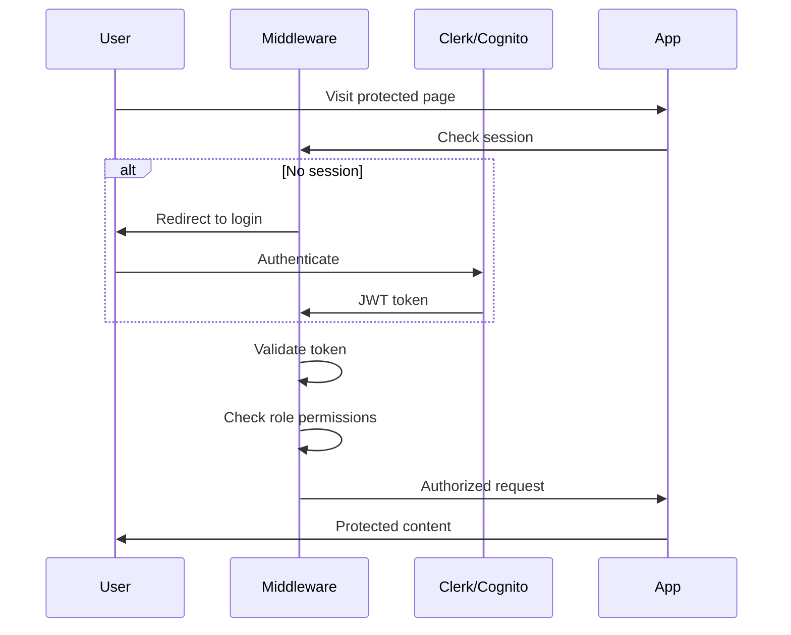
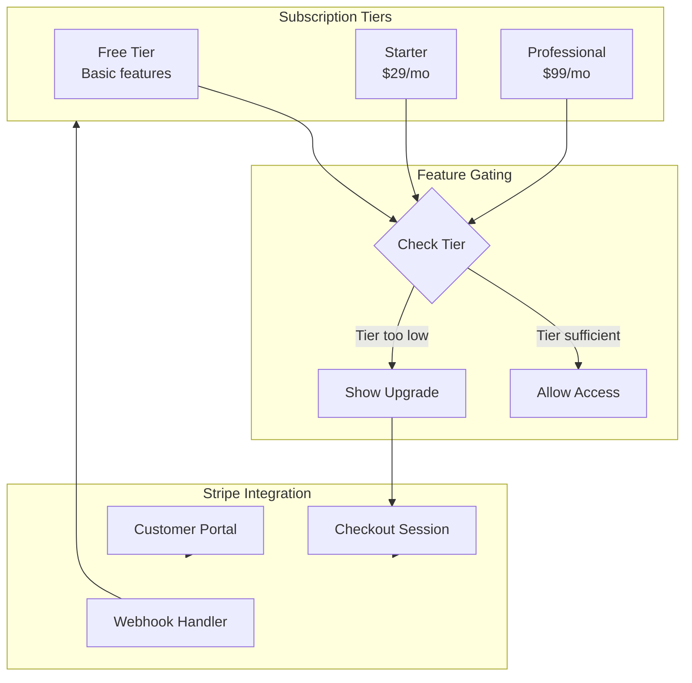
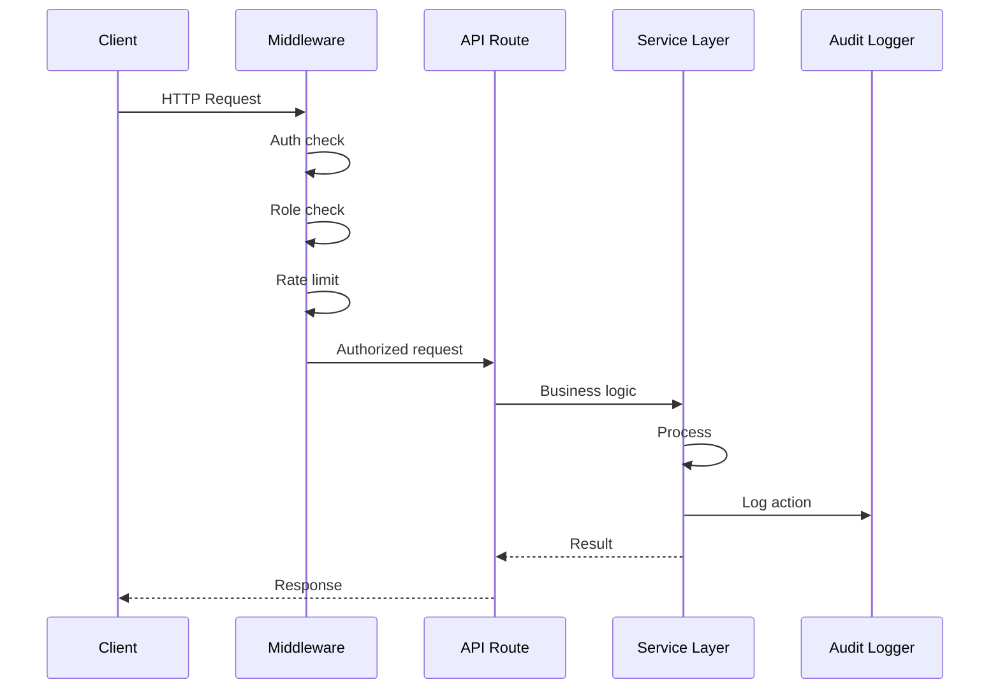
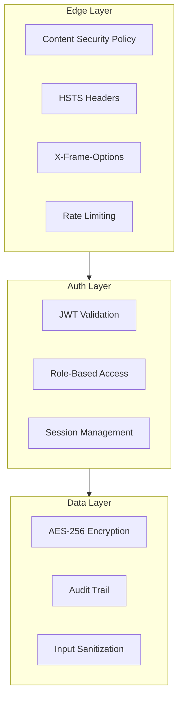

# Architecture — Justice Dev Starter Kit

## System Overview

```mermaid
flowchart TB
    subgraph Client["Client (Browser)"]
        Pages[Next.js Pages]
        Components[React Components]
        AuthProvider[Auth Provider]
        BillingGate[Billing Gate]
    end

    subgraph Middleware["Edge Middleware"]
        AuthMW[Auth Middleware]
        RoleMW[Role Middleware]
        RateLimit[Rate Limiter]
    end

    subgraph API["API Routes"]
        AuthAPI[/api/auth]
        BillingAPI[/api/billing]
        AIAPI[/api/ai]
        DocAPI[/api/documents]
    end

    subgraph Services["Service Layer"]
        AuthLib[Auth Helpers]
        StripeLib[Stripe Billing]
        AILib[AI + Guardrails]
        DocLib[Doc Generation]
        StorageLib[Encrypted Storage]
        AuditLib[Audit Logger]
    end

    subgraph External["External Services"]
        Clerk[Clerk / Cognito]
        Stripe[Stripe]
        OpenAI[OpenAI]
        S3[AWS S3]
        DB[(Database)]
    end

    Pages --> AuthProvider
    Pages --> BillingGate
    Pages --> Components
    Components --> API
    API --> Middleware
    Middleware --> AuthMW
    Middleware --> RoleMW
    Middleware --> RateLimit
    AuthAPI --> AuthLib
    BillingAPI --> StripeLib
    AIAPI --> AILib
    DocAPI --> DocLib
    AuthLib --> Clerk
    StripeLib --> Stripe
    AILib --> OpenAI
    StorageLib --> S3
    AuditLib --> DB
```

## Authentication Flow



## Billing and Tier Gating



## Request Lifecycle



## Security Architecture


