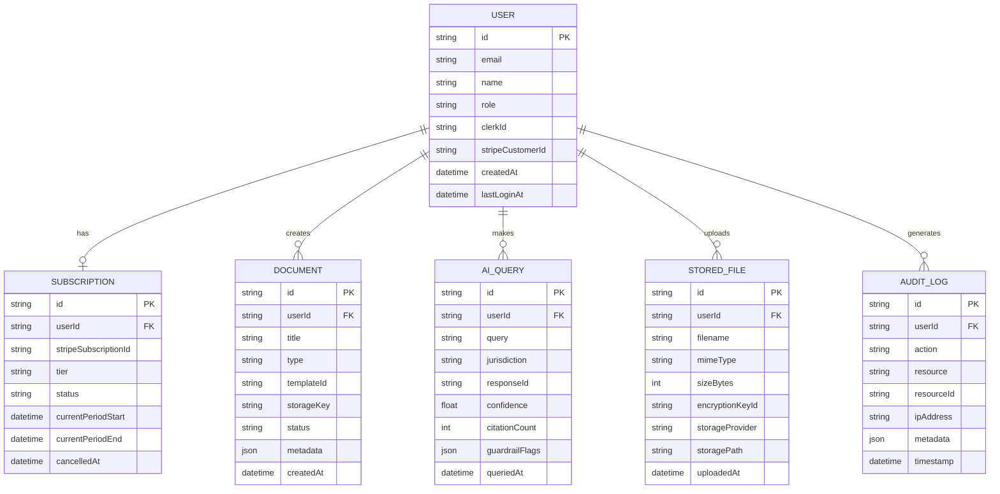

# Data Model — Justice Dev Starter Kit

## Entity Relationship Diagram

```mermaid
erDiagram
    USER {
        string id PK
        string email
        string name
        string role
        string clerkId
        string stripeCustomerId
        datetime createdAt
        datetime lastLoginAt
    }

    SUBSCRIPTION {
        string id PK
        string userId FK
        string stripeSubscriptionId
        string tier
        string status
        datetime currentPeriodStart
        datetime currentPeriodEnd
        datetime cancelledAt
    }

    DOCUMENT {
        string id PK
        string userId FK
        string title
        string type
        string templateId
        string storageKey
        string status
        json metadata
        datetime createdAt
    }

    AI_QUERY {
        string id PK
        string userId FK
        string query
        string jurisdiction
        string responseId
        float confidence
        int citationCount
        json guardrailFlags
        datetime queriedAt
    }

    STORED_FILE {
        string id PK
        string userId FK
        string filename
        string mimeType
        int sizeBytes
        string encryptionKeyId
        string storageProvider
        string storagePath
        datetime uploadedAt
    }

    AUDIT_LOG {
        string id PK
        string userId FK
        string action
        string resource
        string resourceId
        string ipAddress
        json metadata
        datetime timestamp
    }

    USER ||--o| SUBSCRIPTION : "has"
    USER ||--o{ DOCUMENT : "creates"
    USER ||--o{ AI_QUERY : "makes"
    USER ||--o{ STORED_FILE : "uploads"
    USER ||--o{ AUDIT_LOG : "generates"
```
