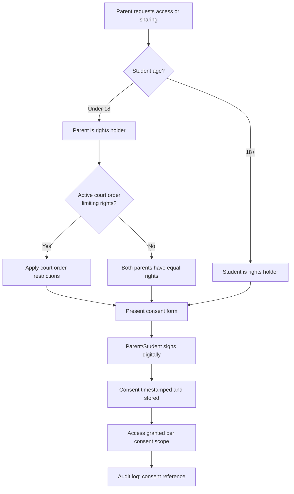

# FERPA Compliance Framework — CoTrackPro

> **Status:** Production  
> **Applicability:** All CoTrackPro deployments used in educational contexts or involving student data  
> **Last Updated:** 2026-04-06  
> **Owner:** Security & Compliance Team

---

## Table of Contents

1. [Overview](#overview)
2. [Educational Record Classification](#educational-record-classification)
3. [Student Data Protection Requirements](#student-data-protection-requirements)
4. [Parental Consent Workflows](#parental-consent-workflows)
5. [Data Breach Notification Procedures](#data-breach-notification-procedures)
6. [Record Retention Policies](#record-retention-policies)
7. [Student Rights Under FERPA](#student-rights-under-ferpa)
8. [Legitimate Educational Interest](#legitimate-educational-interest)
9. [Directory Information Policy](#directory-information-policy)
10. [Compliance Verification](#compliance-verification)

---

## Overview

The **Family Educational Rights and Privacy Act (FERPA)** (20 U.S.C. § 1232g; 34 CFR Part 99) governs access to educational information maintained by educational institutions receiving federal funding.

CoTrackPro intersects with FERPA when:

- School counselors or social workers use the platform to coordinate with co-parents about a child's educational placement or behavioral records
- Courts or GALs request educational records as part of custody proceedings
- IEP (Individualized Education Program) documents or 504 plans are stored in CoTrackPro
- Communication between parents and schools is documented within the platform

### FERPA Applicability to CoTrackPro

| Use Case | FERPA Applies | CoTrackPro Role |
|----------|--------------|----------------|
| School counselor coordinating with divorced parents | ✅ Yes | Third-party system — school must authorize |
| IEP documents uploaded by parents | ✅ Yes | Data processor; school is responsible party |
| Parent-to-parent communication about school performance | ⚠️ Indirect | FERPA protections follow the record |
| Court-ordered educational record sharing | ✅ Yes | Subpoena/court order exception applies |
| General child custody documentation | ❌ No | Not educational records |
| Child welfare documentation | ❌ No | FERPA does not apply |

---

## Educational Record Classification

### What Constitutes an Educational Record Under FERPA

**Educational Records** are records, files, documents, and other materials that:
1. Contain information directly related to a student, **and**
2. Are maintained by an educational agency or institution, or by a party acting for or on behalf of the agency or institution

### Data Classification Table

**Class EF-1 — Core Educational Records**

| Record Type | Examples | Access Control | Retention |
|------------|---------|---------------|-----------|
| Academic transcripts | Grades, GPA, course history | Student/parent + authorized school officials | Permanent |
| Disciplinary records | Suspension, expulsion records | Limited to school officials with LEI | 5 years after student leaves |
| Special education records | IEPs, evaluation reports, 504 plans | Parent + IEP team members | 5 years after services end (state law may extend) |
| Health records (school-maintained) | School nurse records, vaccination records | Parent + school health personnel | Per state law |

**Class EF-2 — Supplementary Educational Records**

| Record Type | Examples | Access Control | Retention |
|------------|---------|---------------|-----------|
| Attendance records | Daily attendance, tardiness | Educators + parents | 3 years after graduation |
| Behavioral reports | Classroom incidents, teacher notes | Teacher + principal + parent | 3 years after graduation |
| Test/assessment results | Standardized test scores | Student/parent + educators | 5 years after graduation |
| Communications | Teacher-parent emails, notes | Parties to communication | 3 years |

**Class EF-3 — Non-Educational Records (FERPA does not apply)**

| Record Type | Notes |
|------------|-------|
| Law enforcement records | Created by law enforcement, not school officials |
| Records of students 18+ who are no longer enrolled | If records solely in possession of maker and not shared |
| Employment records of students as employees | If not related to student status |
| Medical records covered by HIPAA | Treated under HIPAA, not FERPA |

---

## Student Data Protection Requirements

### Technical Safeguards for Student Data

| Requirement | Implementation | Standard |
|------------|---------------|---------|
| Encryption at rest | AES-256-GCM for all EF-1 and EF-2 records | NIST SP 800-57 |
| Encryption in transit | TLS 1.3 minimum | NIST SP 800-52 |
| Access logging | All access to educational records logged | 34 CFR §99.32 |
| De-identification | 18+ identifier removal before any research use | FERPA research exception |
| Data minimization | Collect only educational records necessary for service | Privacy by design |
| Right to inspect | Technical mechanism to provide access within 45 days | 34 CFR §99.10 |
| Right to amend | Process to challenge and amend inaccurate records | 34 CFR §99.20 |

### Access Control for Educational Records

```
Access to educational records is PROHIBITED unless one of the following applies:
  1. Student/parent has provided written consent
  2. Access falls within a FERPA exception (see §99.31)
  3. Records are subject to a court order or subpoena
  4. Emergency health or safety exception applies
```

### FERPA Exceptions (34 CFR §99.31)

| Exception | Permitted Disclosure | CoTrackPro Implementation |
|-----------|---------------------|--------------------------|
| School officials with legitimate educational interest | Defined by school; documented | Require school authorization before granting access |
| Other schools where student is enrolling | Transfer situation | Require enrollment verification |
| State/local education authorities | Audit/evaluation purposes | Government verification required |
| Financial aid purposes | Limited to need determination | Not applicable to CoTrackPro |
| Judicial orders or lawfully issued subpoenas | Must notify parent/student first if possible | Legal process workflow |
| Health/safety emergency | Articulable and significant threat | Emergency access workflow |
| Directory information | Only if proper opt-out offered | See Directory Information Policy |

---

## Parental Consent Workflows

### Consent Requirements

**Who Can Provide Consent?**

| Student Age / Situation | Who Holds FERPA Rights |
|------------------------|----------------------|
| Student under 18 | Parents (both, unless court order limits rights) |
| Student 18+ or in post-secondary institution | Student holds own rights |
| Student 18+ but parents claim as dependent (26 U.S.C. §152) | Both student and parents may have rights |
| Deceased student | State law governs |

**Joint Custody Considerations:**

> Under FERPA, **both parents retain rights** to educational records unless a court order, state statute, or legally binding document specifically revokes those rights. CoTrackPro must:
> 1. Verify court orders that limit educational record access
> 2. Document any restrictions in the custody record
> 3. Apply access controls accordingly
> 4. Not require the custodial parent's permission to share records with the non-custodial parent (absent a court order)

### Written Consent Requirements (34 CFR §99.30)

A valid FERPA consent must specify:

1. Records to be disclosed
2. Purpose of the disclosure
3. Party or class of parties to whom disclosure may be made
4. Date and signature of parent or eligible student

**CoTrackPro Consent Form Template:**

```
FERPA RECORD DISCLOSURE AUTHORIZATION

I, [Parent/Guardian Name], the [mother/father/guardian] of [Student Name], 
date of birth [DOB], who attends [School Name] in [Grade/Year], hereby 
authorize the disclosure of the following educational records:

Records Authorized: [Specify: e.g., IEP documents, attendance records, 
                    behavioral reports, academic transcripts]

Authorized Recipient: [Name and relationship]

Purpose: [Specify purpose, e.g., "custody proceeding in [Court/Case Number]"]

Effective Period: From [Date] to [Date] or until revoked in writing.

I understand this authorization may be revoked at any time by written notice.

Signature: _____________________ Date: __________
Printed Name: _________________
Relationship to Student: _______
```

### Digital Consent Workflow



### Consent Revocation

- Parents or eligible students may revoke consent in writing at any time
- Revocation takes effect upon receipt; future disclosures prohibited
- Disclosures already made pursuant to consent are not affected by revocation
- Revocation documented in audit log; access controls updated within 1 business day

---

## Data Breach Notification Procedures

> **Note:** FERPA does not include an explicit breach notification requirement like HIPAA. However, educational institutions have obligations under state laws and general duty of care. CoTrackPro follows best-practice notification standards.

### Notification Framework

| Trigger | Timeline | Recipients | Required Content |
|---------|---------|-----------|-----------------|
| Unauthorized access to educational records | Within 72 hours of discovery | Affected institution + parents | What happened, records affected, steps taken |
| Inadvertent disclosure to unauthorized party | Within 24 hours of discovery | Affected institution + FERPA rights holders | Disclosure details, recipient info, mitigation |
| System breach affecting student data | Per state law (typically 30-72 hours) | Institution + state authorities + affected families | Breach scope, data types, response actions |
| Internal policy violation | Within 48 hours | Institution compliance officer | Incident details, disciplinary action |

### State-Specific Notification Laws

CoTrackPro tracks student data breach notification requirements for all 50 states. Key examples:

| State | Notification Timeline | Authority |
|-------|----------------------|-----------|
| California | 72 hours (CCPA/SOPIPA) | AG + affected individuals |
| New York | Expedient / most recent state law | AG |
| Texas | 60 days | AG + affected individuals |
| Florida | 30 days | AG + individuals if 500+ affected |

*Full state matrix available in the Compliance Operations runbook.*

### Breach Assessment Protocol

1. **Determine if FERPA records were compromised** — apply definition
2. **Identify affected students** — by ID, not name, in initial assessment
3. **Assess disclosure scope** — who accessed, what data, time window
4. **Notify institution** — they determine if parent notification required
5. **Document assessment** — retain for 7 years

---

## Record Retention Policies

### FERPA Record Retention Schedule

| Record Type | Minimum Retention | CoTrackPro Action at Expiry |
|------------|------------------|---------------------------|
| Permanent records (transcripts) | Permanent | Transfer to institution upon exit |
| Disciplinary records | 5 years after student leaves | Secure deletion + audit log |
| Special education records | Longer of 5 years after exit or student's 24th birthday | Notify parent before deletion |
| Behavioral records | 3 years after graduation | Secure deletion |
| Consent records | Duration of consent + 5 years | Secure deletion |
| Audit logs of record access | 7 years | Immutable storage; then secure deletion |
| Breach notifications | 7 years | Immutable storage |

### Retention Hold Procedures

Educational records under active legal hold (litigation, investigation, audit) must **not** be deleted even if past normal retention date.

```
Hold Trigger Events:
  - Receipt of litigation hold notice
  - Open investigation by education authority
  - Active FERPA complaint with Department of Education
  - Court order to preserve records

Hold Workflow:
  1. Legal/compliance team issues hold notice
  2. Records flagged in system with hold identifier
  3. Automated deletion suspended for held records
  4. Hold reviewed quarterly; released when matter resolved
  5. Retention clock restarts upon hold release
```

### Secure Deletion Standards

When records are deleted following retention expiry:

- **Database records:** Cryptographic erasure (delete encryption key) + record overwrite
- **File attachments:** DoD 5220.22-M 3-pass overwrite or crypto-erase (S3 object deletion with KMS key destruction)
- **Backups:** Retained in encrypted form until backup retention period; then deleted from all backup media
- **Audit log of deletion:** Retained for 7 years even after record deletion

---

## Student Rights Under FERPA

### Summary of Rights

| Right | Description | CoTrackPro Mechanism |
|-------|-------------|---------------------|
| Right to Inspect (§99.10) | Access own educational records within 45 days | Self-service portal + request workflow |
| Right to Amend (§99.20) | Request amendment of inaccurate records | Amendment request form; institution decides |
| Right to Consent (§99.30) | Control disclosure beyond exceptions | Digital consent management |
| Right to File Complaint | Complain to Department of Education | Provide FPCO contact information |

### Inspection Request Workflow

```
1. Parent/eligible student submits inspection request (written)
2. CoTrackPro routes to institution's FERPA compliance contact
3. Institution reviews and grants/denies within 45 days
4. If granted: records made available via secure portal
5. If denied: institution provides written reason; appeal process initiated
```

**Contact:** U.S. Department of Education, Student Privacy Policy Office (SPPO)  
400 Maryland Avenue, SW, Washington, DC 20202  
studentprivacy@ed.gov | (202) 260-3887

---

## Legitimate Educational Interest

### Definition

A school official has a **legitimate educational interest** when they need to review an educational record to fulfill their professional responsibility.

### CoTrackPro Implementation

Educational platform integrations must provide a written definition of "legitimate educational interest" that includes:

1. The job description or role categories of school officials
2. The specific types of records accessible to each role
3. The circumstances under which access is appropriate
4. Procedures for monitoring access

**Example Policy Statement:**

> "A school official has a legitimate educational interest in a student's records maintained in CoTrackPro when the official needs the information to: (a) perform a task specified in their job description; (b) perform a task related to a student's education; (c) perform a task related to the student's discipline; or (d) provide a service or benefit to the student or the student's family. Access is limited to information that is necessary to fulfill that interest."

---

## Directory Information Policy

### CoTrackPro Treatment of Directory Information

Directory information (name, address, phone number, email, grade level, etc.) may be disclosed without consent **only if** the institution:

1. Has given annual notice to parents/students of what is designated as directory information
2. Has given parents/students the opportunity to opt out
3. Has not received an opt-out from the individual

**CoTrackPro default: No directory information is disclosed without explicit consent**, regardless of opt-out status, because CoTrackPro is not an educational institution and does not rely on the directory information exception.

---

## Compliance Verification

### Internal Compliance Reviews

| Activity | Frequency | Owner |
|---------|---------|------|
| FERPA access audit | Quarterly | Compliance team |
| Consent record review | Semi-annually | Legal + compliance |
| Retention schedule compliance check | Annually | Data governance team |
| School partner FERPA training verification | Annually | Partner success team |
| Breach notification drill | Annually | Security + legal team |

### External Validation

- Annual review by education law counsel
- FERPA-specific controls reviewed in SOC 2 Type II audit
- State student privacy law compliance review for key deployment states

### FERPA Complaint Response

If CoTrackPro receives a complaint or inquiry from the **Family Policy Compliance Office (FPCO)**:

1. Immediately notify Legal and Compliance teams
2. Preserve all relevant records under legal hold
3. Respond within timeframe specified in FPCO correspondence
4. Cooperate fully with FPCO investigation
5. Implement any required corrective actions

---

> **Legal Notice:** This document provides compliance guidance and does not constitute legal advice. Consult qualified education law counsel for advice specific to your institution's FERPA obligations.

> **Contact:** privacy@cotrackpro.com | Student Privacy Policy Office: studentprivacy@ed.gov
